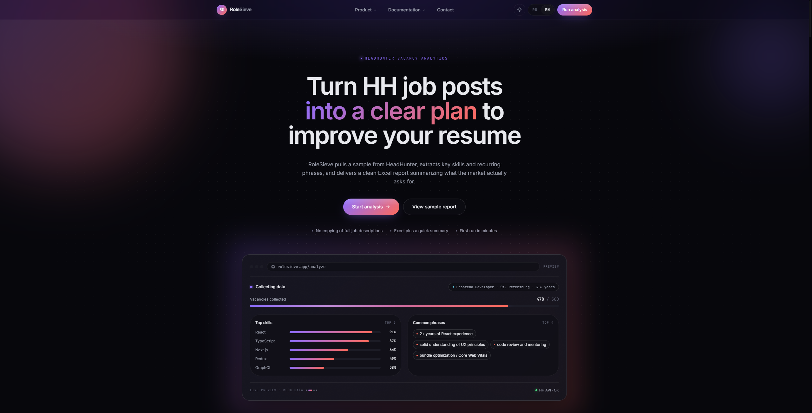
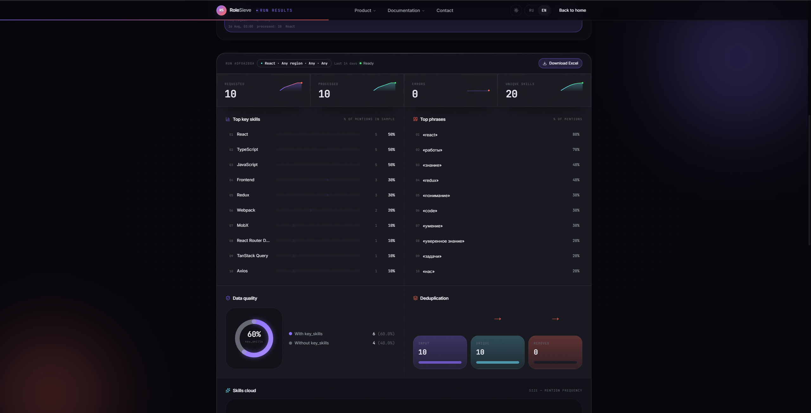
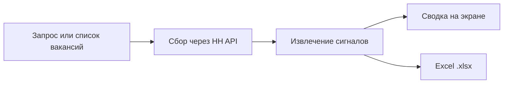
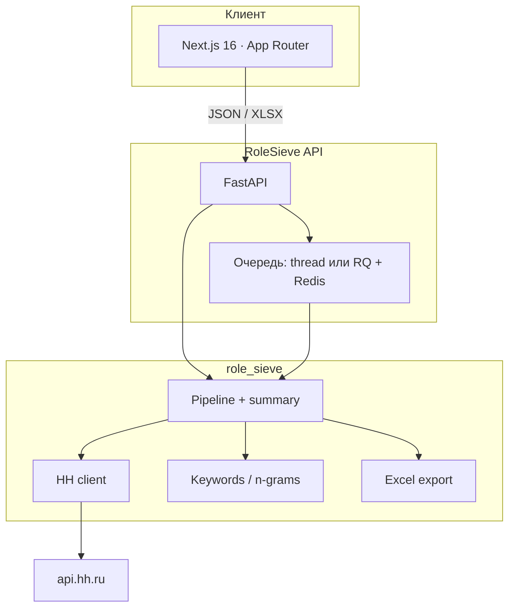

<p align="center">
  
</p>

<h1 align="center">RoleSieve</h1>

<p align="center">
  <strong>Аналитика вакансий HeadHunter → понятный план улучшения резюме</strong><br>
  <em>HeadHunter vacancy analytics for resume decisions, not guesswork.</em>
</p>

<p align="center">
  <a href="#зачем-это-нужно">Зачем</a> ·
  <a href="#что-получает-пользователь">Продукт</a> ·
  <a href="#как-это-работает">Как работает</a> ·
  <a href="#архитектура">Архитектура</a> ·
  <a href="#быстрый-старт">Быстрый старт</a> ·
  <a href="#http-api">API</a>
</p>  

<p align="center">
  
  
  
  
  
</p>

<p align="center">
  
</p>

---

## Зачем это нужно

Рынок труда формулирует требования в вакансиях. Люди всё ещё читают их вручную: копируют навыки, спорят «что сейчас в тренде», правят резюме на глаз.

RoleSieve закрывает этот разрыв. Сервис берёт выборку публичных вакансий HeadHunter, извлекает **ключевые навыки** и **повторяющиеся формулировки** и отдаёт два артефакта, с которыми можно сразу работать:

1. Интерактивную сводку на экране — топ навыков, фразы, покрытие данных, дедупликация.
2. Чистый Excel-отчёт — для фильтров, сводных таблиц и разбора с заказчиком.

Полные тексты вакансий **не копируются и не хранятся**. Источник — только [официальный HH API](https://dev.hh.ru). RoleSieve не аффилирован с HeadHunter.

---

## Для кого

| Роль | Задача, которую закрывает продукт |
| --- | --- |
| Соискатель | Понять, чего не хватает в резюме под целевую роль, а не «что кажется важным». |
| Карьерный консультант | За вечер собрать доказательную выборку по сегменту и разобрать её с клиентом в Excel. |
| HR / market researcher | Сравнить требования между ролями, регионами и периодами — с историей прогонов. |
| Команда продукта | Поставить аналитику вакансий как сервис: UI, API, очередь, деплой, контракт ответов. |

---

## Что получает пользователь

- **Два режима выборки.** Manual — список ID или ссылок HH. Auto — поисковый запрос плюс фильтры HH: регион, опыт, формат работы, работодатель, период.
- **Топ `key_skills`.** Навыки из поля вакансии, а не догадки по тексту.
- **Частотные фразы.** N-граммы из описания с лемматизацией русского языка (pymorphy2), стоп-словами и отсечением коротких дублей.
- **Дашборд прогона.** KPI, рейтинги, облако навыков, покрытие `key_skills`, ошибки API, поток дедупликации Input → Unique → Removed.
- **Excel-отчёт.** Заголовок, ключевые фразы, навыки, ID, ссылка, уникальные значения; подсветка повторов; без «простыни» описаний.
- **История прогонов.** Параметры и результаты можно открыть повторно и сравнить сегменты.
- **RU / EN.** Интерфейс и документация на двух языках.

Интерактивный пример отчёта — страница `/sample`. Полный прогон — `/analyze`.

<p align="center">
  
</p>

---

## Как это работает



1. **Запрос.** Пользователь вставляет ссылки HH или задаёт поиск с фильтрами рынка.
2. **Сбор.** API ходит в HeadHunter с паузами и ретраями на 429 / 5xx / сеть. Дубликаты вакансий снимаются с сохранением порядка.
3. **Сигналы.** Из `key_skills` берём навыки, из `description` — частотные фразы. HTML описания в отчёт не попадает.
4. **Выход.** Сводка в UI и файл Excel. Длинные прогоны уходят в асинхронную очередь (`job_id` → статус → скачивание).

---

## Архитектура

Продукт — два деплоя с общим доменным ядром. Фронт не ходит в HH напрямую.



| Слой | Стек | Ответственность |
| --- | --- | --- |
| `frontend/` | Next.js 16, React 19, Tailwind 4, Framer Motion | Лендинг, `/analyze`, `/sample`, документация, i18n |
| `web/` | FastAPI, Pydantic, CORS, API key | HTTP-контракт, лимиты, request id, стриминг `.xlsx` |
| `role_sieve/` | requests, openpyxl, BeautifulSoup, pymorphy2 | HH-клиент, пайплайн, ключевики, Excel, очередь |
| `hh_keyskills_export.py` | CLI | Тот же пайплайн без UI — для автоматизаций и отладки |

Асинхронные джобы: если задан `ROLESIEVE_REDIS_URL`, задачи ставятся в RQ. Иначе выполняется фоновый поток на том же процессе — удобно для локальной разработки и небольших инсталляций.

---

## Репозиторий

```text
RoleSieve/
├── frontend/              # продукт: лендинг, анализ, docs
├── web/                   # FastAPI-приложение
├── role_sieve/            # доменная логика (без HTTP)
├── tests/                 # контракт API, Excel, история джоб
├── scripts/hh_app_token.py
├── Dockerfile             # образ API
├── hh_keyskills_export.py # CLI
└── docs/assets/           # бренд и скриншоты продукта
```

---

## Быстрый старт

Нужны **Python 3.10+** (в Docker — 3.12) и **Node.js 20+**.

### 1. API

```bash
python -m venv .venv
# Windows: .venv\Scripts\activate
# macOS / Linux: source .venv/bin/activate

pip install -r requirements.txt
copy .env.example .env          # Windows
# cp .env.example .env          # macOS / Linux
```

В `.env` достаточно `ROLESIEVE_HH_USER_AGENT`. `HH_TOKEN` повышает устойчивость к лимитам HH — токен приложения из [dev.hh.ru/admin](https://dev.hh.ru/admin).

```bash
python -m uvicorn web.app:app --host 127.0.0.1 --port 8000
```

Проверка: [http://127.0.0.1:8000/health](http://127.0.0.1:8000/health) · Swagger: [http://127.0.0.1:8000/docs](http://127.0.0.1:8000/docs)

### 2. Веб-приложение

```bash
cd frontend
copy .env.example .env.local    # Windows
# cp .env.example .env.local    # macOS / Linux
npm install
npm run dev
```

Откройте [http://localhost:3000](http://localhost:3000).

### 3. Docker (только API)

```bash
docker build -t rolesieve-api .
docker run --env-file .env -p 8000:8000 rolesieve-api
```

---

## HTTP API

Базовый префикс: `/api/v1`. Если задан `API_SHARED_KEY`, клиент обязан передать заголовок `X-API-Key`. В каждом ответе есть `X-Request-Id`. У синхронного экспорта сводка уходит в заголовок `X-Export-Summary` (base64url JSON).

| Метод | Путь | Назначение |
| --- | --- | --- |
| `GET` | `/health` | Liveness |
| `POST` | `/api/v1/export/manual` | Excel по списку ID / URL |
| `POST` | `/api/v1/export/auto` | Поиск + Excel |
| `POST` | `/api/v1/summary/auto` | Поиск + JSON-сводка без файла |
| `POST` | `…/async` (те же ресурсы) | Постановка джоба, ответ `{ job_id }` |
| `GET` | `/api/v1/jobs` | Список прогонов |
| `GET` | `/api/v1/jobs/{id}` | Статус, прогресс, summary |
| `GET` | `/api/v1/jobs/{id}/download` | Готовый `.xlsx` |
| `GET` | `/api/v1/meta/areas` · `/suggest` · `/employers` · `/dictionaries` | Справочники HH для фильтров UI |

Лимит выборки по умолчанию — **100 вакансий** на запрос (`HH_EXPORT_MAX_VACANCIES`).

Пример ручного экспорта:

```http
POST /api/v1/export/manual
Content-Type: application/json

{
  "vacancy_ids_or_urls": [
    "https://hh.ru/vacancy/131474430",
    "131234053"
  ],
  "kw_top_n": 30,
  "kw_max_ngram": 3
}
```

Фильтры auto-режима совпадают с HH: `queries`, `pages`, `per_page`, `area`, `experience`, `work_format`, `employer_id`, `period`.

---

## Конфигурация

| Переменная | Где | Назначение |
| --- | --- | --- |
| `HH_TOKEN` | API | Bearer `access_token` приложения HH |
| `ROLESIEVE_HH_USER_AGENT` | API | `HH-User-Agent`, формат `RoleSieve/1.0 (email)` |
| `HH_CLIENT_ID` / `HH_CLIENT_SECRET` | только `scripts/hh_app_token.py` | Получение `access_token`, в запросы вакансий не подставляются |
| `CORS_ORIGINS` | API | Origin фронта через запятую |
| `API_SHARED_KEY` | API | Если задан — обязателен `X-API-Key` |
| `HH_EXPORT_MAX_VACANCIES` | API | Потолок выборки |
| `ROLESIEVE_REDIS_URL` | API | RQ; без неё — in-process thread |
| `NEXT_PUBLIC_API_URL` | frontend | Публичный URL API |
| `NEXT_PUBLIC_API_KEY` | frontend | Значение `API_SHARED_KEY`, если включён |

`client_secret` и токен живут только на сервере. `.env` в git не попадает.

Получить токен приложения:

```bash
python scripts/hh_app_token.py
```

Либо скопировать `access_token` в кабинете [dev.hh.ru/admin](https://dev.hh.ru/admin) после первой выдачи.

---

## Деплой

Типовая схема: **фронт на Vercel**, **API на хосте с длинным timeout** (Railway, Render, Fly.io, VPS, Kubernetes). Экспорт выборки — операция минуты, serverless с коротким лимитом для API не подходит.

1. Процесс API: `uvicorn web.app:app --host 0.0.0.0 --port $PORT`
2. В `CORS_ORIGINS` — прод-домен фронта (`https://your-app.vercel.app`).
3. На Vercel: `NEXT_PUBLIC_API_URL` = публичный HTTPS URL API.

---

## Данные и ограничения

- Используются только публичные вакансии через официальный API HH (hh.ru и связанные площадки). Скрапинга страниц нет.
- В артефактах — агрегаты и метаданные прогона. Сырой HTML описания после извлечения сигналов не сохраняется.
- Клиент уважает `Retry-After`, повторяет 429 / 5xx / сетевые сбои, держит паузу между запросами (`sleep_s`).
- У части вакансий HH не заполняет `key_skills` — это видно в метрике покрытия, а не «теряется молча».
- Экстракция фраз — частотная эвристика по n-граммам, не LLM. Шум в хвосте рейтинга нормален; топ пригоден для решений по резюме.

---

## Excel-отчёт

Колонки файла, который отдаёт API и CLI:

| Колонка | Поле |
| --- | --- |
| A | Vacancy Title |
| B | Key Words — фразы из описания |
| C | Key Skills — `key_skills[].name` |
| D | ID |
| E | Link |
| F | Unique Keywords |
| G | Unique Skills |

Каждая вакансия — блок строк: ID и ссылка только в первой строке блока. Более короткий список оставляет пустые ячейки, пока не закончится длинный. Повторы в колонках навыков и фраз подсвечиваются условным форматированием.

CLI дописывает строки в копию шаблона `template.xlsx` и кладёт файл в `reports/`. HTTP API всегда собирает новый workbook и не меняет шаблон на диске.

<details>
<summary>CLI для автоматизаций</summary>

```bash
python hh_keyskills_export.py --mode manual --manual-input manual_ids.txt
python hh_keyskills_export.py --mode auto --queries "Python разработчик" --pages 2
```

`manual_ids.txt` — один ID или URL на строку. Полезные флаги: `--kw-top-n`, `--kw-max-ngram`, `--pages`, `--per-page`, `--sleep-s`.
</details>

---

## Тесты

```bash
python -m unittest discover -s tests -v
```

Покрыты контракт HTTP (заголовки сводки, дедуп, 422), якорь записи в Excel и история джоб. Тесты не ходят в HH.

Линт фронта: `cd frontend && npm run lint`.

---

## Команда

Документация для пользователя — в самом продукте: `/docs`, `/docs/quickstart`, `/docs/report`. Этот README — вход для инженеров, аналитиков и ревьюеров репозитория.

Вопросы по продукту: страница `/contact`.

---

<p align="center">
  <sub>© 2026 RoleSieve · Not affiliated with HeadHunter · Public API only</sub>
</p>
